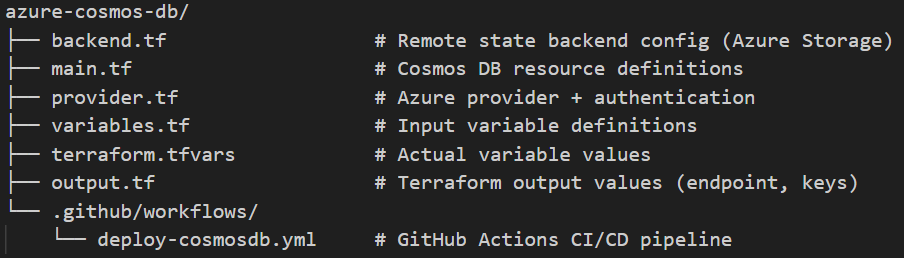

#  Azure Cosmos DB Deployment with Terraform + GitHub Actions

This project demonstrates how to provision an **Azure Cosmos DB (MongoDB API)** using **Terraform**, and automate the deployment via **GitHub Actions CI/CD**.

---

##  Project Structure




---

##  Required Secrets in GitHub

In your GitHub repo, go to **Settings → Secrets and Variables → Actions** and add:

AZURE_CREDENTIALS  and the value is in the json format
```
{
  "clientId": "xxxxxxxx-xxxx-xxxx-xxxx-xxxxxxxxxxxx",
  "clientSecret": "your-very-secure-client-secret",
  "tenantId": "yyyyyyyy-yyyy-yyyy-yyyy-yyyyyyyyyyyy",
  "subscriptionId": "zzzzzzzz-zzzz-zzzz-zzzz-zzzzzzzzzzzz"
}
```

These are required for the GitHub Actions workflow to authenticate with Azure.
How you get these : in shell run the command :

```
# az ad sp create-for-rbac --name "<App registration name(Service Principal)>" --role Contributor --scopes /subscriptions/$(az account show --query id -o tsv) --sdk-auth

```

---

##  GitHub Actions CI/CD

The included workflow (`.github/workflows/deploy-cosmosdb.yml`) automatically runs:

- On every push to the `main` branch with "azure-cosmos-db" changes

Steps:
1. Checkout code
2. Set up Terraform
3. Run `terraform init`, `validate`, `plan`, and `apply`

---

##  Resources Created
- Azure Resource Group
- Cosmos DB Account (MongoDB API)

Terraform can only provision the Cosmos DB MongoDB account.
If you're practicing or demoing CI/CD, that one resource is enough.
If you're building a real app, you'll also need to create:

A MongoDB database (manually or via script)

Collections (tables)

---

##  Outputs
After apply, you'll see:
- Cosmos DB endpoint
- Primary key (marked sensitive)

These are defined in `output.tf`.

---

##  Cleanup

```
terminal
terraform init
terraform destroy 

```
# References
Azure Cosmos DB (MongoDB API) - Terraform Docs

https://registry.terraform.io/providers/hashicorp/azurerm/latest/docs/resources/cosmosdb_account
